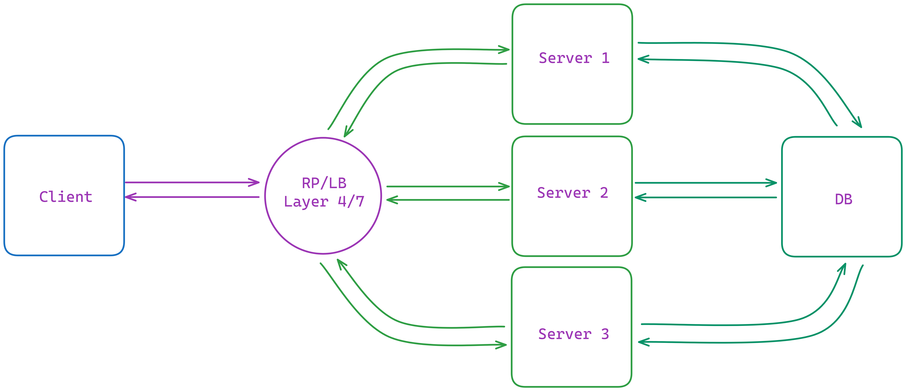

# Layer 4&7 Load Balancer Deployment


## Overview

This repository demonstrates the deployment of a Layer 4&7 load balancer using Docker and Nginx. The setup includes configuring Nginx to act as a load balancer for distributing HTTP traffic across multiple backend servers. Modern web applications often require robust infrastructure to handle varying levels of incoming traffic while maintaining high availability and performance. Implementing a load balancer is a common strategy to achieve these goals, distributing incoming requests across multiple backend servers.

## Features

- **Scalability:** Easily scale your web application by adding more backend server instances.
- **Performance:** Improve application performance by distributing incoming traffic across multiple servers.
- **Reliability:** Ensure high availability and redundancy with a resilient load balancing setup.
- **Flexibility:** Customize load balancing configurations to suit your specific application requirements.


### Prerequisites

- [Docker](https://www.docker.com/) installed on your machine.
- Basic understanding of Docker Compose for managing multi-container Docker applications.

## Getting Started

To get started with this project, follow these steps:

1. **Clone the Repository:** 
   ```bash
   git clone https://github.com/TheToriqul/Layer-4-7-Load-Balancer-Deployment.git
   ```

2. **Navigate to the Project Directory:**
   ```bash
   cd Layer-4-7-Load-Balancer-Deployment
   ```

3. **Start the Application:**
   ```bash
   docker-compose up
   ```

4. **Access the Application:**
   Open your web browser and navigate to `http://localhost`.

## Configuration

### Docker Compose File (`docker-compose.yml`)

- Defines services for Nginx server and backend servers.
- Specifies Nginx configuration and backend server Dockerfile locations.
- Sets up networking for communication between services.

### Nginx Configuration File (`nginx.conf`)

- Configures Nginx as a Layer 7 (HTTP) load balancer.
- Defines upstream servers for backend server pool.
- Listens on port 80 and forwards HTTP requests to backend servers.

### Dockerfile (`./server/Dockerfile`)

- Sets up a Node.js application image for backend servers.
- Installs dependencies and copies application code.
- Exposes port 3000 and specifies command to run the Node.js application.


## Additional Resources

- [Nginx Documentation](https://nginx.org/en/docs/)
- [Docker Documentation](https://docs.docker.com/)
- [Docker Compose Documentation](https://docs.docker.com/compose/)

## Contributing

Contributions to this project are welcome! Feel free to submit issues or pull requests with any improvements, bug fixes, or feature enhancements.

## License

This project is licensed under the [MIT License](LICENSE).

## Acknowledgements

- [Nginx](https://nginx.org/): For providing a powerful and efficient web server and reverse proxy solution.
- [Docker](https://www.docker.com/): For enabling containerization and simplifying the deployment process.
- [Node.js](https://nodejs.org/): For providing a JavaScript runtime for building scalable and high-performance applications.

## Contact

For any inquiries or support, feel free to contact [toriqul.int@gmail.com](mailto:toriqul.int@gmail.com).
